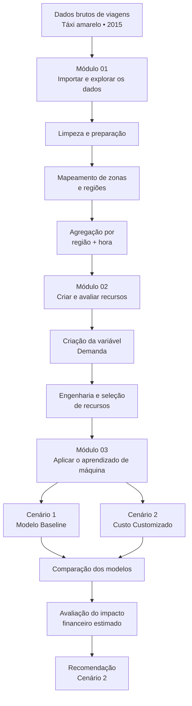

# 🚕 Manhattan Taxi Demand Forecasting

<p align="center">
  
</p>

<p align="center">
  <strong>Predictive Modeling and Machine Learning with MATLAB</strong>
</p>

<p align="center">


</p>

---

## 📋 Resumo Executivo

Este projeto utiliza dados históricos de viagens de táxi amarelo de 2015 para prever o nível de demanda em diferentes regiões e horários de Manhattan. A análise compara duas abordagens: uma orientada à acurácia geral e outra alinhada aos custos dos erros de classificação para a estratégia de despacho.

Os resultados mostram que o **Cenário 2, baseado em custo customizado, é a abordagem recomendada**, pois reduz a perda financeira total estimada em **22,8%**, equivalente a **US$ 2.857,41**, com uma redução de apenas **0,38 ponto percentual na acurácia geral**.

---

# 📑 Sumário

- [📋 Resumo Executivo](#-resumo-executivo)
- [📌 Contexto do Projeto](#-contexto-do-projeto)
- [🎯 Problema de Negócio](#-problema-de-negócio)
  - [🗺️ Regiões analisadas](#️-regiões-analisadas)
- [💡 Solução / Recomendação](#-solução--recomendação)
  - [Cenário 1 — Modelo Baseline](#cenário-1--modelo-baseline)
  - [Cenário 2 — Modelo com Custo Customizado](#cenário-2--modelo-com-custo-customizado)
  - [Recomendação](#recomendação)
- [📈 Impacto](#-impacto)
  - [O que esse resultado significa?](#o-que-esse-resultado-significa)
  - [Nota sobre o impacto financeiro](#nota-sobre-o-impacto-financeiro)
- [📊 Principais Resultados](#-principais-resultados)
  - [Desempenho geral](#desempenho-geral)
  - [Erros mais relevantes](#erros-mais-relevantes)
  - [Impacto financeiro estimado](#impacto-financeiro-estimado)
- [🧠 Principais Insights](#-principais-insights)
  - [1. Acurácia não conta toda a história](#1-acurácia-não-conta-toda-a-história)
  - [2. O contexto de negócio deve influenciar a avaliação do modelo](#2-o-contexto-de-negócio-deve-influenciar-a-avaliação-do-modelo)
  - [3. A demanda segue um padrão cíclico ao longo do dia](#3-a-demanda-segue-um-padrão-cíclico-ao-longo-do-dia)
  - [4. A demanda apresenta distribuição desbalanceada](#4-a-demanda-apresenta-distribuição-desbalanceada)
  - [5. Os recursos precisam estar disponíveis antes da decisão](#5-os-recursos-precisam-estar-disponíveis-antes-da-decisão)
  - [6. A melhor solução depende da decisão que queremos apoiar](#6-a-melhor-solução-depende-da-decisão-que-queremos-apoiar)
- [🏗️ Pipeline do Projeto](#️-pipeline-do-projeto)
- [🔎 Como o Projeto foi Desenvolvido](#-como-o-projeto-foi-desenvolvido)
  - [Módulo 01: Importar e explorar os dados](#módulo-01-importar-e-explorar-os-dados)
  - [Módulo 02: Criar e avaliar recursos](#módulo-02-criar-e-avaliar-recursos)
  - [Módulo 03: Aplicar o aprendizado de máquina](#módulo-03-aplicar-o-aprendizado-de-máquina)
- [▶️ Como Executar o Projeto](#️-como-executar-o-projeto)
  - [Pré-requisitos](#pré-requisitos)
  - [📦 Arquivos necessários](#-arquivos-necessários)
  - [📥 Dados de viagens](#-dados-de-viagens)
  - [🚀 Passo a passo](#-passo-a-passo)
- [🚀 Próximas Etapas](#-próximas-etapas)
- [👤 Autor](#-autor)


---

## 📌 Contexto do Projeto

Este projeto foi desenvolvido como **desafio final da formação "Especialização em Ciência de Dados Prática com MATLAB"**, oferecida pela **MathWorks por meio do Coursera**.

A proposta foi aplicar, em um problema de negócio, conhecimentos de preparação e exploração de dados, criação e avaliação de recursos, modelagem preditiva e análise de resultados utilizando MATLAB.

O desafio escolhido envolve a previsão do nível de demanda de táxis em diferentes regiões de Manhattan. Mais do que construir um modelo preditivo, o objetivo foi entender como as previsões poderiam apoiar decisões de despacho e contribuir para a redução das perdas financeiras associadas a decisões inadequadas.

---

## 🎯 Problema de Negócio

Para uma operação de táxis, saber **onde a demanda está concentrada em determinado momento** pode ajudar a decidir para onde os veículos disponíveis devem ser direcionados.

O desafio é que diferentes decisões podem gerar consequências diferentes para a operação. Por exemplo, enviar um táxi para uma região que apresenta baixa demanda pode representar uma oportunidade perdida de atendimento em outra região.

A estratégia de despacho considerada neste projeto estabelece três regras principais:

- Priorizar a região de **Alta demanda** mais próxima quando houver disponibilidade;
- Caso não exista uma região de Alta demanda disponível, direcionar o táxi para a região de **Média demanda** mais próxima;
- **Nunca ir ou permanecer em uma região de Baixa demanda**.

A partir dessa estratégia, surge a principal questão do projeto:

> **O melhor modelo é necessariamente aquele que apresenta a maior acurácia ou aquele que toma decisões mais alinhadas aos custos e às prioridades da operação?**

O projeto busca responder justamente a essa questão.

---

### 🗺️ Regiões analisadas

Para representar a distribuição espacial da demanda, as zonas de táxi foram agrupadas
em seis regiões utilizadas ao longo da análise:

<p align="center">
  
</p>

---

## 💡 Solução / Recomendação

Foram avaliadas duas abordagens para apoiar a estratégia de despacho.

### Cenário 1 — Modelo Baseline

O primeiro cenário utiliza um modelo de classificação com foco na **acurácia geral**.

Sua função é estabelecer uma referência de desempenho para entender até que ponto um modelo pode classificar corretamente os níveis de demanda quando o principal objetivo é maximizar o número total de previsões corretas.

### Cenário 2 — Modelo com Custo Customizado

O segundo cenário considera que **nem todos os erros possuem o mesmo impacto para a operação**.

Por isso, foi criada uma estratégia que atribui diferentes custos aos possíveis erros de classificação, dando maior importância aos erros que podem resultar em decisões mais prejudiciais para o despacho.

A lógica é priorizar a identificação correta das regiões de Baixa demanda e evitar, principalmente, situações em que uma região de Baixa demanda seja interpretada como uma região de Alta demanda.

### Recomendação

Com base nos resultados obtidos, o **Cenário 2 é a abordagem recomendada**.

Embora apresente uma pequena redução na acurácia geral, ele apresenta melhor alinhamento com a estratégia operacional definida e menor perda financeira estimada.

---

## 📈 Impacto

O principal resultado do projeto mostra que **maximizar a acurácia geral não necessariamente significa maximizar o valor gerado para o negócio**.

Ao considerar os diferentes impactos dos erros de classificação, o Cenário 2 apresentou:

| Indicador | Resultado |
|---|---:|
| **Redução da perda financeira estimada** | **22,8%** |
| **Diferença estimada entre os cenários** | **US$ 2.857,41** |
| **Variação da acurácia geral** | **-0,38 p.p.** |

A perda financeira total estimada foi reduzida de aproximadamente **US$ 12.512,35 no Cenário 1 para US$ 9.654,94 no Cenário 2**.

### O que esse resultado significa?

A análise demonstra que pode ser mais interessante aceitar uma pequena redução na acurácia quando isso significa **reduzir os erros que possuem maior impacto para a operação**.

> **O melhor modelo para um problema de negócio não é necessariamente aquele que acerta mais, mas aquele que toma decisões mais adequadas ao contexto em que será utilizado.**

### Nota sobre o impacto financeiro

Os valores apresentados representam **estimativas calculadas a partir dos dados históricos e das premissas estabelecidas no projeto**. Portanto, os resultados devem ser interpretados como uma referência para apoiar decisões, e não como uma garantia de economia financeira futura.

---

## 📊 Principais Resultados

### Desempenho geral

O modelo baseline do Cenário 1 apresentou **71,71% de acurácia no conjunto de teste**.

<p align="center">
  
</p>

O Cenário 2 apresentou uma redução de apenas **0,38 ponto percentual na acurácia geral**, enquanto conseguiu reduzir os erros considerados mais relevantes para a estratégia de despacho.

<p align="center">
  
</p>

### Erros mais relevantes

A comparação entre os cenários foi direcionada principalmente para três tipos de erro:

| Tipo de erro | Interpretação |
|---|---|
| **Baixa → Alta** | Erro mais crítico para a estratégia de despacho |
| **Baixa → Média** | Também deve ser reduzido |
| **Alta → Baixa** | Erro que representa uma oportunidade potencialmente perdida |

O Cenário 2 foi desenvolvido especificamente para reduzir os dois primeiros tipos de erro, aceitando algum aumento controlado em falsos positivos para a classe Baixa.

### Impacto financeiro estimado

O cálculo financeiro considera dois grupos principais de erros:

**Baixa demanda classificada como Média/Alta**

Representa uma situação em que um táxi poderia ser direcionado para uma região com menor demanda do que a prevista. A perda é estimada utilizando a tarifa mediana das outras regiões na mesma hora como referência do valor que poderia ter sido obtido em uma decisão diferente.

**Alta demanda classificada como Baixa**

Representa uma oportunidade potencialmente perdida de atender uma região com alta demanda. Nesse caso, a estimativa considera a tarifa média associada à própria região e horário.

---

## 🧠 Principais Insights

### 1. Acurácia não conta toda a história

A acurácia geral é útil para comparar modelos, mas não necessariamente representa o impacto de cada decisão para o negócio.

Em um problema operacional, um erro pode ser muito mais relevante do que outro.

### 2. O contexto de negócio deve influenciar a avaliação do modelo

A estratégia de despacho determina quais erros são mais prejudiciais e quais podem ser tolerados.

Por isso, a avaliação foi além da quantidade total de acertos e passou a considerar o impacto dos diferentes tipos de erro.

### 3. A demanda segue um padrão cíclico ao longo do dia

<p align="center">
  
</p>

A demanda apresenta dois picos claros de proporção de demanda **Alta**: um pela manhã e outro no início da noite, com um vale marcante durante a madrugada, por volta das 4h às 6h. A demanda **Média** se mantém como a categoria predominante na maior parte do dia, enquanto a demanda **Baixa** apresenta maior variação ao longo das horas.

Esse comportamento cíclico e não linear ajuda a explicar por que `HourOfDay` se mostrou, junto com `Region`, um dos preditores mais relevantes do projeto. Também ajuda a interpretar a dificuldade do método `fscmrmr` em capturar a importância dessa variável, uma vez que sua relação com a demanda não segue um padrão monotônico. 

### 4. A demanda apresenta distribuição desbalanceada

<p align="center">
  
</p>

A variável `Demanda` foi dividida em três categorias:

- **Baixa:** `NetPickups < 0`
- **Média:** `0 ≤ NetPickups < 15`
- **Alta:** `NetPickups ≥ 15`

No conjunto agregado, a distribuição foi:

- **Baixa:** 31,6%
- **Média:** 53,0%
- **Alta:** 15,4%

A classe **Média** é a mais frequente, enquanto **Alta** representa a menor parcela das observações. Essa distribuição deve ser considerada na avaliação dos modelos, já que a acurácia geral pode não refletir igualmente o desempenho em todas as classes.

### 5. Os recursos precisam estar disponíveis antes da decisão

O conjunto final de preditores utilizado na modelagem foi composto por:

- `Region`
- `HourOfDay`
- `DayOfWeek`
- `Month`
- `IsWeekend`
- `IsHoliday`

Variáveis como distância média, duração média e tarifa média foram excluídas do conjunto final por apresentarem risco de **circularidade**, uma vez que dependem das mesmas viagens utilizadas para definir `NetPickups` e `Demanda`. Além disso, essas variáveis apresentavam valores ausentes em parte das observações.

### 6. A melhor solução depende da decisão que queremos apoiar

O principal aprendizado do projeto é que **Machine Learning deve ser avaliado dentro do contexto da decisão que ele pretende apoiar**.

Neste caso, o Cenário 2 apresentou melhor equilíbrio entre desempenho preditivo, estratégia operacional e impacto financeiro estimado.

---

## 🏗️ Pipeline do Projeto



O pipeline representa a evolução do projeto desde os dados brutos até a recomendação final:

**Dados → Preparação → Recursos → Modelagem → Comparação → Impacto → Decisão**

---

## 🔎 Como o Projeto foi Desenvolvido

O projeto foi organizado em três módulos principais, acompanhando a evolução natural de um projeto de Ciência de Dados.

---

### Módulo 01: Importar e explorar os dados

Neste módulo, os dados brutos de viagens de táxi amarelo de 2015 são importados, organizados, limpos e explorados para compreender sua estrutura e identificar informações relevantes para o problema de negócio.

O processo começa com a importação dos **12 arquivos mensais** de viagens utilizando um `fileDatastore`. Em seguida, cada viagem recebe informações de zona de táxi e é relacionada às regiões consideradas no projeto.

A etapa de preparação também combina critérios personalizados de limpeza com a rotina de limpeza baseline fornecida durante o curso. O processo reduziu o conjunto de dados de **2.910.069 para 2.817.585 viagens**, correspondendo à remoção de aproximadamente **3,18% dos registros** nessa etapa.

Após a preparação, os registros são agregados por **região e hora**, formando uma grade completa com:

- 6 regiões;
- 8.760 horas de 2015;
- 52.560 combinações região-hora.

A variável `NetPickups` é então calculada como:

```text
NetPickups = Pickups - Dropoffs
```


---

### Módulo 02: Criar e avaliar recursos

<p align="center">
  
</p>

Neste módulo, os dados preparados são transformados em informações adequadas para a modelagem.

Primeiro, é criada a variável categórica `Demanda`, dividida em três níveis:

```text
NetPickups < 0       → Baixo
0 ≤ NetPickups < 15  → Médio
NetPickups ≥ 15      → Alto
```


Em seguida, são criados recursos relacionados ao tempo e ao calendário, incluindo:

- Região;
- Hora do dia;
- Dia da semana;
- Mês;
- Final de semana;
- Feriado.

Essas variáveis são avaliadas por diferentes abordagens de seleção e associação, incluindo `fscchi2`, `fscmrmr` e Cramér's V.

Também é avaliada a variável `DayOfYear`, mas ela é descartada posteriormente devido à instabilidade estatística como variável categórica e à ausência de uma tendência clara quando tratada como variável numérica.

Ao final, o conjunto utilizado no Módulo 03 é:

```text
Region
HourOfDay
DayOfWeek
Month
IsWeekend
IsHoliday
```

---

### Módulo 03: Aplicar o aprendizado de máquina

<p align="center">
  
</p>

Neste módulo, os recursos definidos anteriormente são utilizados para treinar e avaliar os modelos de classificação.

Foram desenvolvidas duas abordagens utilizando os mesmos seis preditores e a mesma variável de resposta:

```text
Cenário 1 → Modelo Baseline
             Foco na acurácia geral

Cenário 2 → Modelo com Custo Customizado
             Foco na estratégia de despacho
```

O Cenário 1 utiliza uma árvore de decisão com otimização automática de hiperparâmetros e alcançou **71,71% de acurácia no conjunto de teste**. Também foram explorados modelos ensemble e estratégias de ponderação das classes como parte da análise.

No Cenário 2, uma matriz de custos é utilizada para representar numericamente as prioridades da estratégia de despacho:

```text
                 Previsto
             Baixo  Médio  Alto

Real Baixo      0      5     10
Real Médio      3      0      1
Real Alto       6      1      0
```

Essa abordagem permite avaliar o modelo não apenas pela quantidade de previsões corretas, mas também pelo impacto relativo dos diferentes erros.

Por fim, os erros mais relevantes são convertidos em **perdas financeiras estimadas**, permitindo comparar as duas abordagens sob uma perspectiva de negócio.

> A estrutura acima representa a organização recomendada para o repositório. Os nomes e diretórios podem ser ajustados de acordo com a organização final dos arquivos no GitHub.


---

## ▶️ Como Executar o Projeto

### Pré-requisitos

Para executar o projeto, é necessário ter:

- MATLAB instalado;
- acesso aos arquivos disponibilizados neste repositório;
- os arquivos auxiliares necessários para a execução do pipeline;
- os dados históricos de viagens de táxi utilizados pelo projeto.

O projeto foi desenvolvido utilizando **MATLAB Live Scripts (`.mlx`)**.

---

### 📦 Arquivos necessários

O projeto depende de alguns arquivos auxiliares para realizar a importação, preparação e organização dos dados.

| Arquivo | Descrição |
|---|---|
| [2015 Bank Holidays.csv](./data/reference/2015%20Bank%20Holidays.csv) | Lista de feriados utilizada para identificar períodos de feriado durante a criação dos recursos temporais. |
| [Taxi Regions and Zones.csv](./data/reference/Taxi%20Regions%20and%20Zones.csv) | Arquivo de referência utilizado para relacionar as zonas de táxi às seis regiões consideradas no projeto. |
| [addTaxiZones.mlx](./src/addTaxiZones.mlx) | Função fornecida durante o curso utilizada para adicionar as zonas de coleta e desembarque às viagens de táxi. |
| [basicPreprocessing.mlx](./src/basicPreprocessing.mlx) | Executa a rotina de limpeza e preparação baseline dos dados. |
| [importTaxiDataWithoutCleaning.mlx](./src/importTaxiDataWithoutCleaning.mlx) | Responsável pela importação dos arquivos mensais de viagens sem aplicar a etapa inicial de limpeza. |

Além desses arquivos, o pipeline utiliza os **dados históricos de viagens de táxi amarelo de 2015**, organizados nos 12 arquivos mensais utilizados na etapa de importação.

---

### 📥 Dados de viagens

Os dados brutos utilizados no projeto são compostos pelos registros de viagens de táxi amarelo de 2015.

Por questões de tamanho e organização do repositório, os arquivos de dados podem ser disponibilizados separadamente, conforme a estratégia adotada para publicação do projeto.

O código espera encontrar os arquivos mensais seguindo um padrão semelhante a:

```text
yellow*.csv
```

dentro do diretório definido para os dados de táxi.

---

### 🚀 Passo a passo

#### 1. Clone o repositório

```bash
git clone https://github.com/SEU_USUARIO/manhattan-taxi-demand-forecasting-matlab.git
```

#### 2. Abra o MATLAB

Abra o MATLAB e defina a pasta raiz do projeto como **Current Folder**.

#### 3. Verifique os arquivos necessários

Certifique-se de que os arquivos auxiliares estejam disponíveis nos diretórios esperados:

```text
data/
src/
notebooks/
```

#### 4. Configure os dados

Coloque os arquivos mensais de viagens de táxi na pasta correspondente aos dados utilizados pelo projeto.

#### 5. Verifique o arquivo de zonas

Certifique-se de que o arquivo:

```text
Taxi Regions and Zones.csv
```

esteja disponível no diretório utilizado pelo script de mapeamento.

#### 6. Execute o projeto

Abra o Live Script principal:

```text
LB_PROJECT_CAPSTORE.mlx
```

e execute as seções sequencialmente, respeitando a ordem dos três módulos:

```text
Módulo 01
   ↓
Módulo 02
   ↓
Módulo 03
```

A execução sequencial é importante porque os módulos posteriores utilizam tabelas, variáveis e resultados produzidos nas etapas anteriores.

---


---

## 🚀 Próximas Etapas

Os resultados obtidos fornecem uma base para evoluir o projeto de uma análise histórica para uma solução de apoio à decisão.

Como próximos passos, seria interessante:

- validar a abordagem utilizando dados mais recentes;
- avaliar a estabilidade dos resultados em diferentes períodos;
- incorporar informações adicionais que possam influenciar a demanda;
- aprofundar a validação das premissas utilizadas no cálculo das perdas financeiras;
- avaliar o comportamento dos modelos em períodos de demanda atípica;
- explorar outras abordagens de modelagem;
- transformar as previsões em uma ferramenta de apoio à decisão;
- desenvolver um painel ou aplicação que permita visualizar a demanda esperada por região e horário;
- avaliar a possibilidade de disponibilizar as previsões de forma integrada ao processo operacional de despacho.

O objetivo dessas etapas seria aproximar o projeto de uma solução capaz de apoiar decisões reais de despacho, mantendo a avaliação dos resultados conectada aos impactos operacionais e financeiros.

---

## 👤 Autor

**Lucas Pimenta**

Engenheiro de Produção | Data Science | Machine Learning | Cloud Computing

[](https://github.com/lbarretto)
[](https://www.linkedin.com/)

---

<p align="center">
  <sub>Projeto desenvolvido como desafio final da Especialização em Ciência de Dados Prática com MATLAB.</sub>
</p>

<p align="center">
  <a href="#-manhattan-taxi-demand-forecasting" style="text-decoration:none;">
    ⬆️ Voltar ao início
  </a>
</p>
